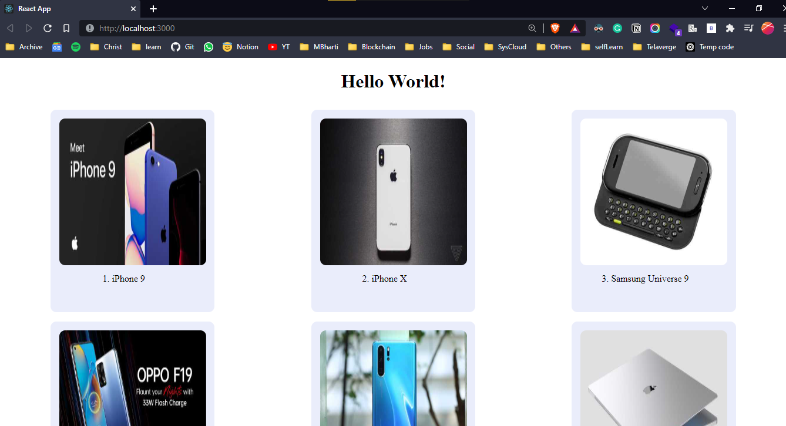

# Pagination-on-scrolling

Implement pagination while scrolling the page and add the next 5 data to the page when we reach at bottom of the page on scroll
---

### Using 
- Axios package to call REST APIs i.e fetch data from API
- API endpoint: https://dummyjson.com/products 
     - Note: skip and limit query parameters can be passed to fetch limited data 
     - (https://dummyjson.com/products?skip=5&limit=10)
- Fetched data displayed with images 

---  
## Screenshots
- [Video: ScreenRecording: pagination-on-scrolling-react](https://www.awesomescreenshot.com/video/10063467?key=bf21850e900f5b07c6fe6a6ecda225eb)
<!--  -->

